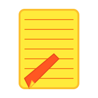
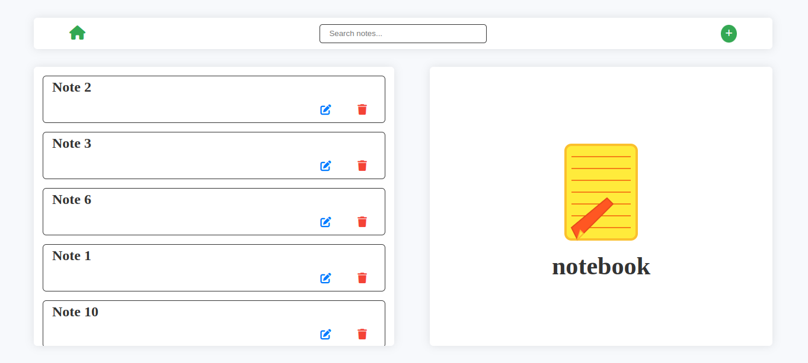
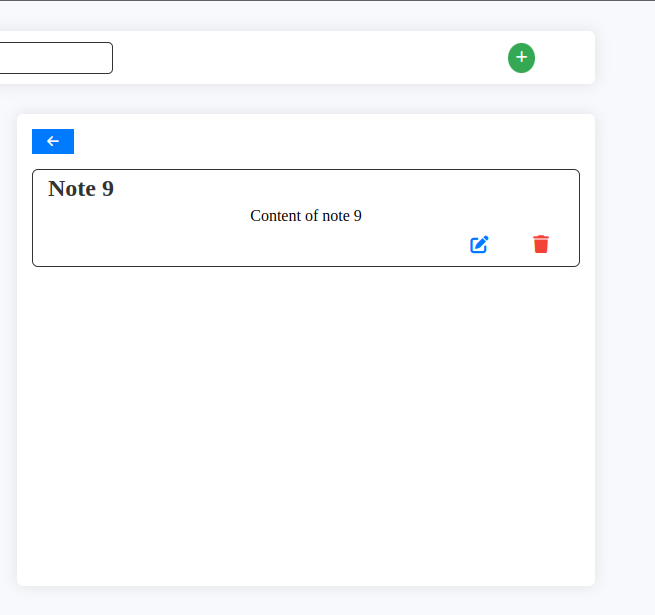
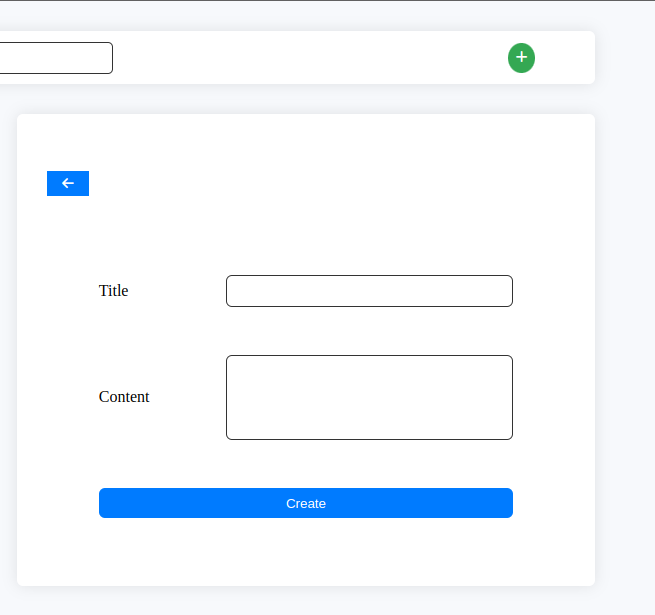
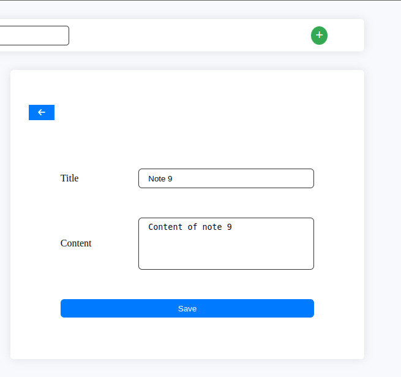
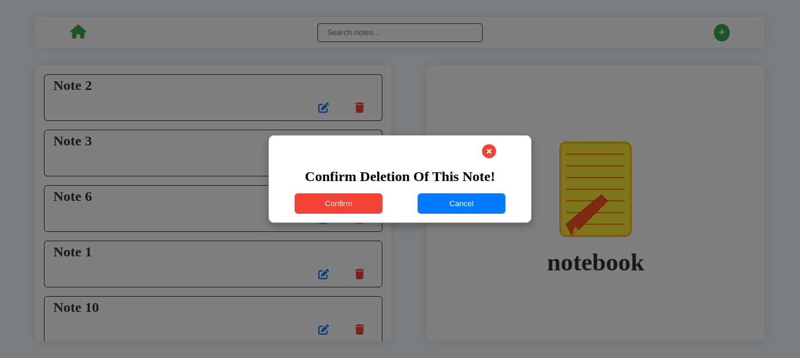

# Notebook 

### Table of Contents

1. Introduction
2. Features
3. Getting started
4. Usage

## Introduction

This is a simple notes application built using Node.js and Express for the backend, and Angular for the frontend. The application allows users to view, add, edit, and delete notes.

## Features

- View all notes
- View a single note
- Add a new note
- Edit an existing note
- Delete a note
  
## Getting started

### 1. Clone the repository:

```bash
git clone https://github.com/M-A-Leli/Notebook.git
```

```bash
cd Notebook
```

### 2. Install dependencies
Run the following command in the root directory to install all dependencies for the root, frontend, and backend:

```bash
npm install
```

This command will:

- Install root dependencies.
- Install frontend dependencies by running `npm install --prefix frontend`.
- Install backend dependencies by running `npm install --prefix backend`.

### 3. Start the Project

After the dependencies are installed, you can start both the frontend and backend servers concurrently with the following command:

```bash
npm run dev
```

This will run:
- `npm run dev:frontend` to start the frontend server.
- `npm run dev:backend` to start the backend server.

### 4. Access the Application

Open your browser and navigate to [http://localhost:4200](http://localhost:4200).
  
## Usage


### Viewing All Notes

To view all notes, navigate to the home page. Click on `my notes` navigation link. You will see a list of all notes stored in the application.



### Viewing a Single Note
To view a single note, click on a single note from the list. This will display the full content of the selected note on the left display.



### Adding a Note
To add a new note, click on the `+` button. Fill in the note title and content, then click the `create` button. The new note will be added to the list.



### Editing a Note
To edit a note, click on the `edit` icon button next to the note you want to edit. Make the necessary changes and click `edit`. The note will be updated with the new information.



### Deleting a Note
To delete a note, click on the "Delete" button next to the note you want to delete. Confirm the deletion, and the note will be removed from the list.



Happy coding!